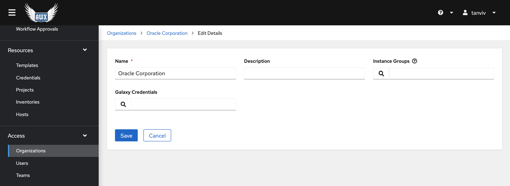
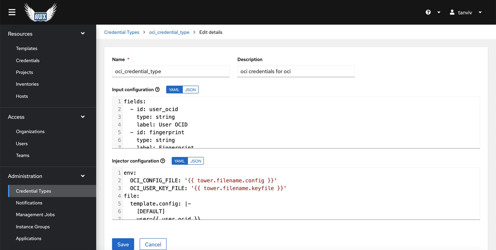
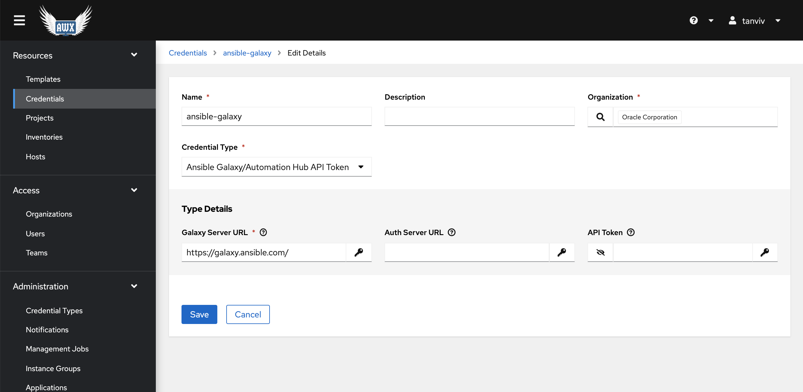
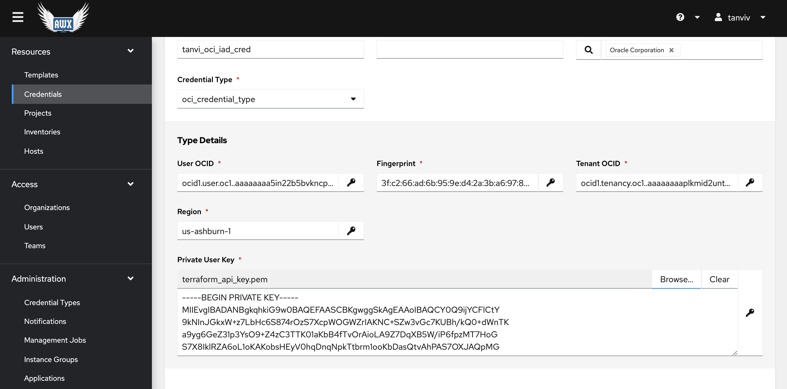
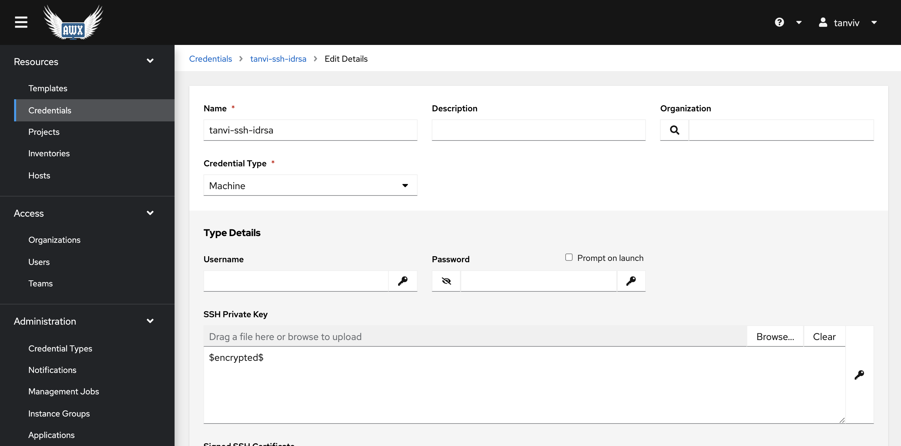
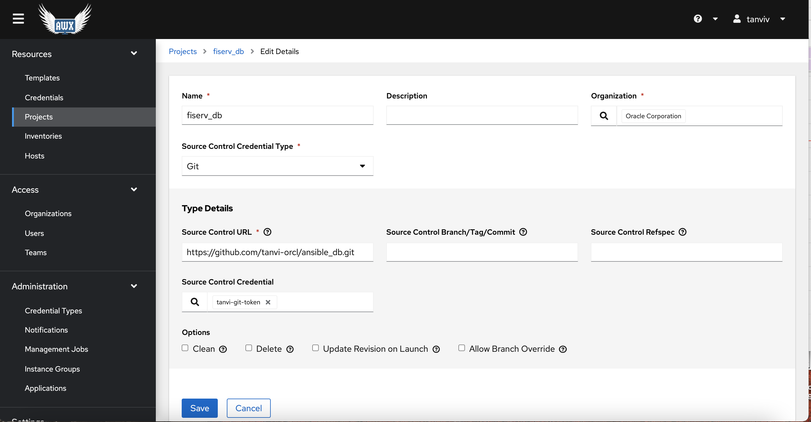
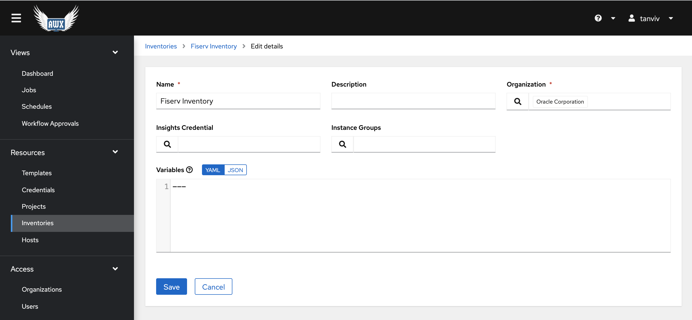
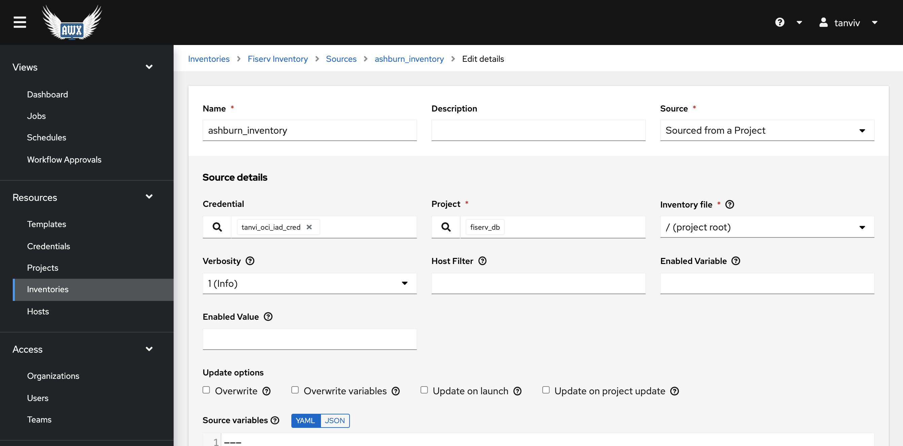
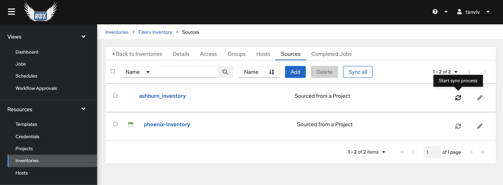
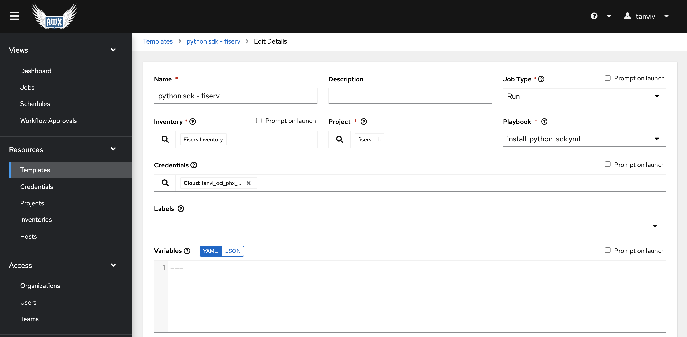

# Ansible for Exadata

This ansible project allows for Exadata Cloud@Customer and Exadata Cloud Service set-up. 

## Getting Started

### AWX Set-Up

1. Provision AWX on an OCI Instance: Follow the steps from https://github.com/oracle-quickstart/oci-ansible-awx.


2. Create Organization: Go to **Organizations** under the **Access** section, and then click on the blue **Add** button on top to create a new organization. Fill out the name of the Organization you would like to use for this project. 

    


3. Create OCI Credential Type: Go to **Credentials Types** under the **Administration** section, and then click on the blue **Add** button on top to create the OCI Credential Type. 

    Add the following code to the **Input Configuration**.
    ```
    fields:
    - id: user_ocid
        type: string
        label: User OCID
    - id: fingerprint
        type: string
        label: Fingerprint
    - id: tenant_ocid
        type: string
        label: Tenant OCID
    - id: region
        type: string
        label: Region
    - id: private_user_key
        type: string
        label: Private User Key
        secret: true
        multiline: true
    required:
    - user_ocid
    - tenant_ocid
    - region
    - fingerprint
    - private_user_key
    ```

    Add the following code to the **Injector Configuration**. 

    ```
    env:
    OCI_CONFIG_FILE: '{{ tower.filename.config }}'
    OCI_USER_KEY_FILE: '{{ tower.filename.keyfile }}'
    file:
    template.config: |-
        [DEFAULT]
        user={{ user_ocid }}
        fingerprint={{ fingerprint }}
        tenancy={{ tenant_ocid }}
        region={{ region }}
    template.keyfile: '{{ private_user_key }}'
    ```

    


3. Create credentials: Go to **Credentials** under the **Resources** section, and then click on the blue **Add** button on top to create the following Credentials.

    - Ansible Galaxy - **Ansible Galaxy/Automation Hub API Token**  Credential Type. Be sure to input the Organization created in step 2 and https://galaxy.ansible.com/ as the Galaxy Server URL.

        

    - Github credentials - **Source Control** Credential Type. Enter your github username and then create a Personal Access Token in Github and enter it as your password. Your personal access token will be encrypted for security. 
    
        

    - OCI credentials - **Custom OCI** Credential Type. Enter all the required information. Although not shown in this screenshot, as with the github access token, your private key will be automatically encrypted as well. 

        

    - SSH Keys - **Machine** Credential Type. Enter any SSH Keys to be used in your environment. 

        


4. Set-Up Project: Go to **Projects** under the **Resources** section, and then click on the blue **Add** button on top to create a new project. Add your Organization, Github Credential, and your Github URL.

    

    Any changes you make to your project can be updated in AWX from the **Projects** tab by choosing **Sync Project**.

    


5. Set-Up Inventory: Go to **Inventories** under the **Resources** section, and then click on the blue **Add** button on top to create a new inventory. Add your Organization from step 2.

    

    To add an inventory source, select the **Sources** tab from your newly created inventory and then the blue **Add** button. Source the inventory from your project as shown below and be sure to input your oci credential. This project's inventory.oci.yml file contains details for the oci inventory plugin and allows hosts to be discovered dynamically. 

    

    Update your inventory by going to your inventory sources and then selecting **Start Sync Process**. If the sync is successful, the **Hosts** tab to the left will have discovered the OCI Compute instances in the region specified by your oci credential.

    


## Using Ansible with AWX

### Running a Playbook
 
1. Create a Job Template: To run a playbook, go to **Templates** under the **Resources** section, and then click on the blue **Add** button on top to create a new job. The first playbook you should run is the install_python_sdk playbook to set-up python for the oci-python modules. Fill in the fields as shown below. In this case, we do not have any variables to define at runtime but other playbooks will require certain variables.

    


2. Define Variables
    - vars_file: Individual file name or list of file names for variables to be used for that playbook. Workload specfic. Be sure to edit these files to set variables such as workload_tag (used for naming resources) and database parameters. The vars_file directory has already been included in the code, just have to provide the actual file name (ex: sample_exacs.yml). 
    - hostgroup: Host group to run DB operations on. Currently only required for PDB operations (other playbooks are for provisioning so use localhost).
    - additional variables: These variables are only defined at runtime, not stored in a file. Check out the Playbooks below for instructions on which plays require additional variables.

### Creating a Workflow

Creating a workflow instead of running an individual job allows you to automate a longer process. For example, linking together ExaCS Set-Up + DB Home Set-Up + Database Set-Up. These playbooks are individual since as a user, you might often want to set-up just a database on an existing home, but you might want to automate the initial creation.


## Ansible Codebase

This codebase contains a set of playbooks that can be used individually or combined into a workflow for ExaCS and ExaCC Set-up. Each playbook references ansible roles (an ansible file structure used to group reusable components). Each ansible role folder contains three subdirectories - tasks, defaults, and meta. 

- Tasks: Contains a main.yml file that will be automatically called if the role is invoked. Also contains reusable standalone tasks.
- Defaults: Default variable values for the tasks in that role. These variables have the least precedence and will be overrided by any variables defined in the included variable file (vars_file) or in the ansible job template. Many of these variables are set as null as they are optional variables for the oci tasks and it is your choice whether to define them. For required variables, check the comments on the sample vars_files or the oracle.oci ansible documentation. 
- Meta: Sets collection oracle.oci


### Playbooks

**awx_test.yml**
- Tests if your ansible environment has been set-up correctly. If running from localhost, pulls Network services information to check if your OCI credentials are working and pulls compartment information to check if your variable file was defined. If running from a host, runs a simple shell command to make sure the inventory has been set-up correctly.
- Job Template Variables
    - vars_file
    - hostgroup (localhost or the name of a group from your inventory)

**networking_setup.yml**
- Creates a network for Exadata Cloud Service environment by calling the networking role. Two options for primary ExaCS subnet: a public subnet for testing instances and a private subnet for production instances, defined by the variable prohibit_public_ip_on_vnic.
- Job Template Variables
    - vars_file

**networking_teardown.yml**
- Terminates a basic ExaCS network by calling the individual task networking_teardown from the networking role. Assumes that you used the networking role to set-up the environment.
- Job Template Variables
    - vars_file

**exacs_setup.yml**
- Creates an Exadata Cloud Service environment by spinning up the ExaCS Infrastructure and ExaCS VM Cluster. 
- Job Template Variables
    - vars_file
    - ssh_public_keys (for VM Cluster creation)

**exacc_setup.yml**
- Creates an Exadata Cloud at Customer environment by calling the Exadata VM Cluster role. Assumes that the Exadata Infrastructure has already been provisioned by Oracle.
- Job Template Variables
    - vars_file

**db_create.yml**
- Creates a new database. Assumes that the database home has already been created.
- Job Template Variables
    - vars_file
    - db_admin_password

**db_home_create.yml**
- Creates a new database home. Assumes that the VM cluster has already been created.
- Job Template Variables
    - vars_file

**db_teardown.yml**
- Terminates a database and the accompanying db home.
- Job Template Variables
    - vars_file

**db_backup.yml**
- Description
- Job Template Variables
    - vars_file

**pdb_create.yml**
- Creates a new pdb. Assumes that the database has already been created.
- Job Template Variables
    - vars_file
    - hostgroup
    - oracle_sid
    - pdb_admin_password
    

**pdb_delete.yml**
- Deletes the pdb. Assumes that the database has already been created.
- Job Template Variables
    - vars_file
    - hostgroup


## Additional Resources

Setting up AWX on OCI: https://github.com/oracle-quickstart/oci-ansible-awx

Using OCI with Ansible Tower: https://blogs.oracle.com/cloud-infrastructure/post/using-oracle-cloud-infrastructure-with-ansible-tower-and-awx

OCI Collection for ansible: https://oci-ansible-collection.readthedocs.io/en/stable/collections/oracle/oci/index.html

Connecting Github with AWX: https://murrahjm.github.io/Source-Control-and-the-Tower-Project/

